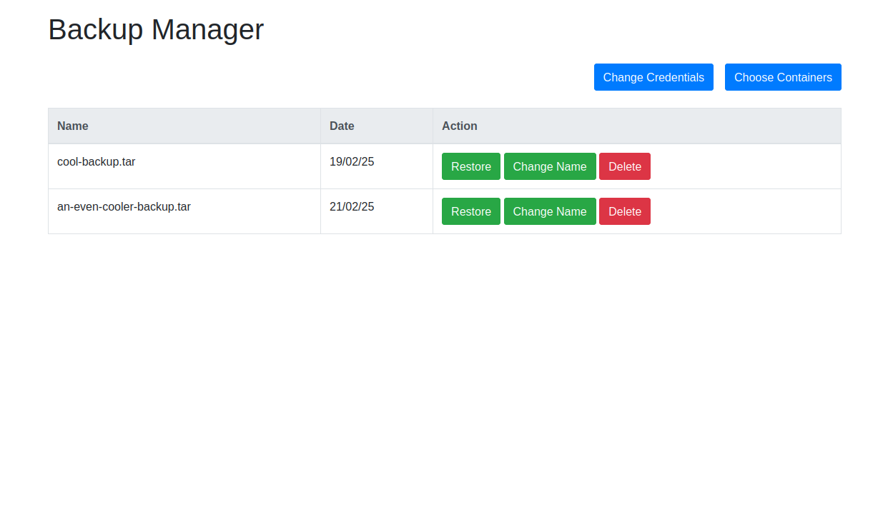

# Backup Manager for Home Assistant

This project is a Backup Manager for Home Assistant. It helps you to manage and automate backups of your Home Assistant configuration and data.

Please note that this project only works for HA installations that were done with Docker, if you are using the Supervised or the Core version of Home Assistant, consider using another solution.

Backups still needs to be created using Home Assistant(See [Creating a backup](#creating-a-backup)), but this webapp simplifies the restoration and management of the backups.



## Features

- Easy one click restore of entire HA installation.
- Stops Home assistant container while restoring.
- Rename of backups made in HA
- Authorization system


## Table of Contents

- [Features](#features)
- [Installation](#installation)
- [Usage](#usage)
- [Creating a backup](#creating-a-backup)
- [Contributing](#contributing)
- [Disclaimer](#disclaimer)
- [License](#license)

## Installation

This is and example `docker-compose.yml` that you might use to install and use _Backup Manager_.
```
  backupmanager:
    image: adarwa/backup-manager
    container_name: backupmanager
    ports:
      - 5678:5678
    volumes:
      - '/var/run/docker.sock:/var/run/docker.sock'
      - '/home/admin/path/to/secrets:/app/secrets' # Secrets folder at the host machine for managing the _Backup Manager_ secret files.
      - type: bind
        source: /home/admin/homeassistant # Home assistant config folder at the host machine for restoring
        target: /app/restore
        bind:
          propagation: shared
```
**Notes:**
 - Depending on your installation you might need to add `privileged: true` for this to work.
 - You might also need to change the mount bind propagation of the **Home Assistant** container to shared. For example:

```
  homeassistant:
    container_name: homeassistant
    image: "ghcr.io/home-assistant/home-assistant:stable"
    volumes:
      - type: bind
        source: /home/admin/homeassistant # Home assistant config directory at the host machine
        target: /config
        bind:
          propagation: shared             # Add this!
      - /etc/localtime:/etc/localtime:ro
      - /run/dbus:/run/dbus:ro
```

## Usage

After installing, you will be able to access the _Backup Manager_ dashboard at `http://your-home-assistant-ip:5678/`.

The default username and password are `admin`. You can change this after logging in.

After the first login, you will be asked to specify which Docker container belongs to Home Assistant, you can select multiple if needed. This is used to gracefully shutdown and start the container(s) during the backup restoration process.

All the created backups you made will show, and you will be able to perform actions on them such as restoring, renaming, and deleting the backup.

## Creating a backup
At this time, this project **does not** support making a backup directly from the interface. Instead, we use the built-in interface of Home Assistant.

1. Click Settings
2. Navigate to System>Backups
3. Click "Create Backup". This might take a while.
4. You will now see the newly created backup at the _Backup Manager_ dashboard!

## Contributing

Contributions are welcome! Please fork the repository and submit a pull request.

Also, if you have a feature idea, fill free to open a discussion on Github or DM me!

## Disclaimer

This project is not affiliated with or endorsed by Home Assistant. It is an independent project created to help users manage their Home Assistant backups more efficiently.

## License

This project is licensed under the GPLv3 License. See the [LICENSE](LICENSE) file for details.